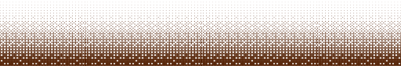
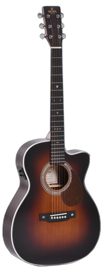
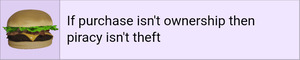
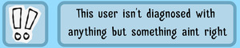
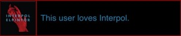

<div align="center">

  

<p>  
 > [!NOTE]
> >This page likely has layout issues on mobile devices, sorry about that!
 
 <h3>
 
 ```diff
 ! HTTP Status Code: 200 OK // welcome to my github profile!
```
</h3>

|  |  |
| --- | --- |
| 	 <br> <ins>i am **nads**, or.. i don't know call me whatever you want</ins> <br>> i don't use github very often (or better yet never), mostly just for testing and having a  _cool profile_.. <br>_______________________________________________________	<br>My neocities is currently unfinished but it's going to be cooler than this github someday! <br><a href="https://9naida.neocities.org"></a> |  <br>  |
|  |  |
|  <br>  |  <br> <br><br> |

 (thank you!) 

</div>
